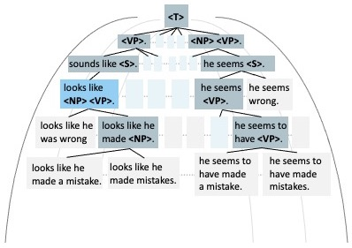

  

<h1>Explicit Syntactic Guidance for Neural Text Generation</h1>

 

<!-- **Authors:** -->
 

_**Yafu Li†‡, Leyang Cui¶, Jianhao Yan†‡, Yongjing Yin†‡, **_

_**Wei Bi¶, Shuming Shi¶, Yue Zhang‡ **_

<!-- **Affiliations:** -->

_† Zhejiang University,
‡ Westlake University,
¶ Tencent AI Lab_

A syntax-guided generation schema that generates the sequence guided by a constituency parse tree in a top-down direction.

