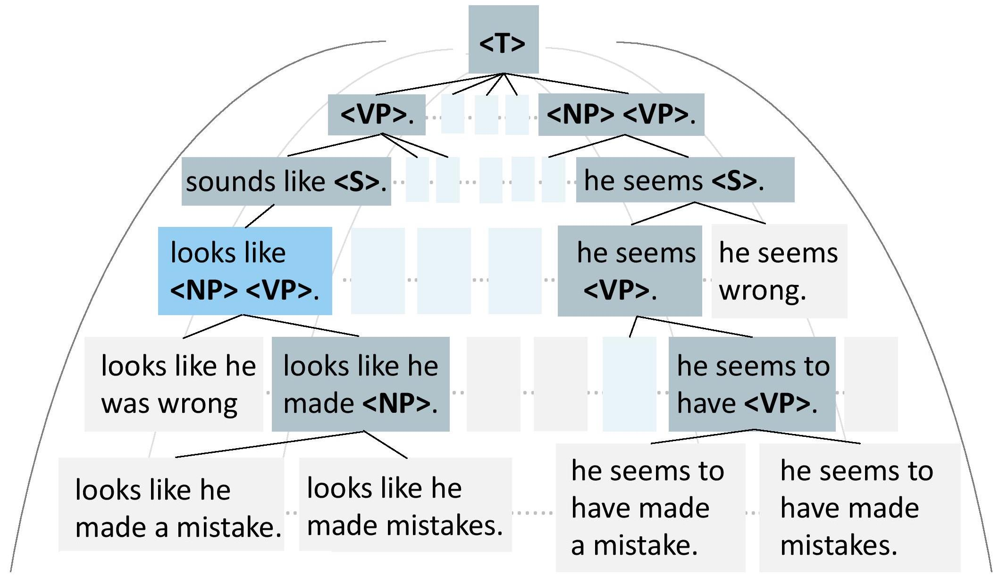

<div align="center">
<p align="center">
  
</p>
</div>

<div align="center">
<h1>Explicit Syntactic Guidance for Neural Text Generation</h1>
</div>

<div align="center">
 


<!-- **Authors:** -->
<br>

_**Yafu Li<sup>†</sup><sup>‡</sup>, Leyang Cui<sup>¶</sup>, Jianhao Yan<sup>†</sup><sup>‡</sup>, Yongjing Yin<sup>†</sup><sup>‡</sup>,<br>**_

_**Wei Bi<sup>¶</sup>, Shuming Shi<sup>¶</sup>, Yue Zhang<sup>‡</sup><br>**_


<!-- **Affiliations:** -->


_<sup>†</sup> Zhejiang University,
<sup>‡</sup> Westlake University,
<sup>¶</sup> Tencent AI Lab_


A syntax-guided generation schema that generates the sequence guided by a constituency parse tree in a top-down direction ([See paper for details](https://arxiv.org/abs/2306.11485)).
</div>


## Environment Setup
To set up the environment, clone the project and run the following script:

```bash
bash setup_env.sh # run under SyntacticGen directory
```

## Toy Example
To demonstrate the process, we have prepared a toy example that includes data preparation, model training, and model inference. Please ensure to specify the "PROJECT_PATH" in each script according to your actual project path.
```bash

# Set the PROJECT_PATH variable to your directory

PROJECT_PATH=$YOUR_DIRECTORY

# Data Preparation: This script builds training triplets using source text data, target text data, and parsing results.

bash $PROJECT_PATH/shell/prepare_data.sh

# Model Training: Train the neural decoder on the training triplets.

bash $PROJECT_PATH/shell/train.sh

# Model Inference: Use the trained model for inference. Structural beam search is enabled if beam size is larger than 1.

bash $PROJECT_PATH/shell/infer.sh

```

We provide the model for paraphrase generation in our paper at Google Drive.

## Arguments
### Training
|Argument	|Description	|
|---------------	|------------------------------------------------	|
| --arch 	| model architecture, use ''at_tree_attn_nonshare'' by default   	|
| --task 	| training procedure is simply a seq2seq task, i.e., ''translation''   	|
| --encoder-layers 	| Number of layers for the source text encoder   	|
| --decoder-layers 	| Number of layers for the target text decoder   	|
| --ctx-encoder-layers 	| Number of layers for the syntax context encoder   	|


### Inference
|Argument	|Description	|
|---------------	|------------------------------------------------	|
| --beam 	| Beam size for structural beam search      	|
|--prev-score-ratio |	Weight (_alpha_) on previous decisions when re-ranking newly updated beam candidates (alpha)|
|--cur-score-ratio  |	Weight on current-level decisions (usually _1-alpha_)|

## Citation
```bibtex
@misc{li2023explicit,
      title={Explicit Syntactic Guidance for Neural Text Generation}, 
      author={Yafu Li and Leyang Cui and Jianhao Yan and Yongjing Yin and Wei Bi and Shuming Shi and Yue Zhang},
      year={2023},
      eprint={2306.11485},
      archivePrefix={arXiv},
      primaryClass={cs.CL}
}
```
